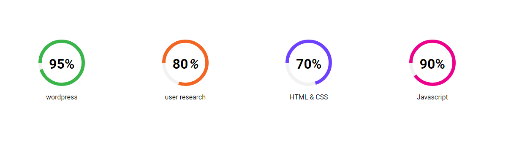

# circle-progress-bar-with-js
It's a circle progress bar.


### Result 


--- 

### Code setup


##### HTML Code
``` html
    <script src="jquery-3.3.1.min.js"></script>
    <script src="circle-progress.min.js"></script>
    <div class="skill-part">
        <div class="skill-item">
            <div class="first circle" data-skill-level="95">
                <h2></h2>
                <span class="sk-name">wordpress</span>
            </div>
        </div>
        <div class="skill-item">
            <div class="second circle" data-skill-level="80">
                <h2></h2>
                <span class="sk-name">user research</span>
            </div>
        </div>
        <div class="skill-item">
            <div class="third circle" data-skill-level="70">
                <h2></h2>
                <span class="sk-name">HTML &amp; CSS</span>
            </div>
        </div>
        <div class="skill-item">
            <div class="fourth circle" data-skill-level="90">
                <h2></h2>
                <span class="sk-name">Javascript</span>
            </div>
        </div>
    </div>

```


#### CSS Code
``` css
body {
    margin: 0;
    padding: 0;
    font-family: 'Roboto', sans-serif;
    font-size: 16px;
}
ul {
    list-style: none;
}
h2 {
    margin: 0;
}
.progressbar-section {
    padding: 100px 0;
}
.container {
    max-width: 1170px;
    margin: 0 auto;
}
.skill-part {
    display: -webkit-box;
    display: -ms-flexbox;
    display: flex;
    -ms-flex-wrap: wrap;
    flex-wrap: wrap;
}
.skill-item {
    -webkit-box-flex: 0;
    -ms-flex: 0 0 25%;
    flex: 0 0 25%;
    max-width: 25%;
    text-align: center;
}
.skill-item h2 {
    font-size: 32px;
    transform: translateY(-75px);
}
.sk-name {
    font-weight: 400;
    display: block;
    transform: translateY(-25px);
}

.my-links {
    text-align: center;
margin-top: 100px;
}
.my-links h3 {
    display: inline-block;
    margin: 0 25px;
}
.my-links ul {
    display: inline-block;
    list-style: none;
    margin: 0;
    padding: 0;
}
.my-links ul li {
    display: inline-block;
}
.my-links ul span {
    width: 45px;
    height: 45px;
    line-height: 45px;
    display: inline-block;
    background-color: #000;
    color: #fff;
    font-size: 22px;
}
.my-links ul p {
    margin: 0;
}
```


##### Javascript Code
``` javascript
    <script>
        (function($){
    'use strict';   

   jQuery(document).ready(function($){
    
 
        // skill circle progress bar
        var skillLevel1 = $('.skill-item .first').data('skill-level');
        var skillLevel2 = $('.skill-item .second').data('skill-level');
        var skillLevel3 = $('.skill-item .third').data('skill-level');
        var skillLevel4 = $('.skill-item .fourth').data('skill-level');
        //first.circle
        $('.first.circle').circleProgress({
        value: '0.' + skillLevel1,
        size: 110,
        emptyFill: "#f2f2f2",
        fill: {
            color: "#39b54a"
        }
        }).on('circle-animation-progress', function(event, progress) {
        $(this).find('h2').html(Math.round(95 * progress) + '<span>%</span>');
        });

        //second.circle
        $('.second.circle').circleProgress({
        value: '0.' + skillLevel2,
        size: 110,
        emptyFill: "#f2f2f2",
        fill: {
            color: "#f26522"
        }
        }).on('circle-animation-progress', function(event, progress) {
        $(this).find('h2').html(Math.round(skillLevel2 * progress) + '<i>%</i>');
        });

        //third.circle
        $('.third.circle').circleProgress({
        value: '0.' + skillLevel3,
        size: 110,
        emptyFill: "#f2f2f2",
        fill: {
            color: "#6e41ff"
        }
        }).on('circle-animation-progress', function(event, progress) {
        $(this).find('h2').html(Math.round(70 * progress) + '<span>%</span>');
        });

        //fourth.circle
        $('.fourth.circle').circleProgress({
        value: '0.' + skillLevel4,
        size: 110,
        emptyFill: "#f2f2f2",
        fill: {
            color: "#ec008c"
        }
        }).on('circle-animation-progress', function(event, progress) {
        $(this).find('h2').html(Math.round(90 * progress) + '<span>%</span>');
        });

        });
    
    })(jQuery);	 
    </script>
```

##### If you're interested this project, Please contribute and hit the star button.

| Social Medias | Links                                                      |
| ------------- | ---------------------------------------------------------- |
| Facebook      | [Facebook Profile](https://www.facebook.com/fahaddevs)     |
| Linkedin      | [Linkedin Profile](https://www.linkedin.com/in/fahaddevs/) |
| Twitter       | [Twitter Profile](https://twitter.com/fahaddevs)           |
| Instagram     | [Instagram Profile](https://www.instagram.com/fahaddevs/)  |
| CodePen       | [CodePen Profile](https://codepen.io/fahaddevs/)           |